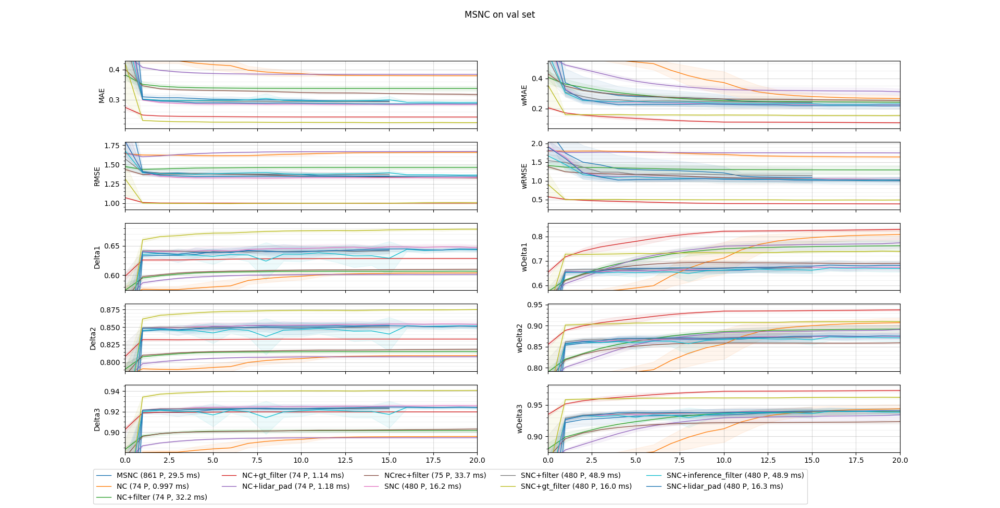

# SNC - Smoothness gated, normalized convolutions for efficient Depth Completion

*Disclamer: These are just some results of research in my free time, implemented like I would have back during my master thesis if I had the time. 
While inference durations may be affected by me doing other stuff on my computer and results by shutting it down and restarting from a checkpoint, all expermients should be reproducible with this repo.
See the usage section at the bottom if you want to try.*


This repo is about creating a small depth completion model where every every weight and every latent can be understood intuitively by humans.
[1] [2] have shown [Normalized Convolutions](https://github.com/abdo-eldesokey/nconv-nyu)[3] to be a simple and efficient approach to unguided depth completion.
This fork improves NConvs to be smaller, faster and involve stronger inductive biases.
NConvs have a tendency to propagate information across depth discontinuities, which is prevented by smoothness gating in SNC.
Finally, the following steps are attempted with mixed results:
Reflective surfaces with missing lidar points are adressed by initially applying depth completion in an occlusion-free native lidar perspective.
Occluded points are filtered out by recurrent versions of the model or during the projection to camera perspective.
Color and reflectance information is seamlessly integrated into the model by approximating an initial smoothness estimate for each perspective.


| Model                    | Loss            | MAE          | RMSE          | Delta1         | Delta2         | Delta3         |   Parameters | BatchDuration   |
|:-------------------------|:----------------|:-------------|:--------------|:---------------|:---------------|:---------------|-------------:|:----------------|
| NConvCNN [2]             | 0.0404 ± 0.0009 | 406 mm ± 11  | 1582 mm ± 21  | 58.18% ± 0.92  | 79.72% ± 0.31  | 88.61% ± 0.26  |          137 | 8 ms ± 0        |
| NConvCNN+2nd_channel [2] | 0.0394 ± 0.0005 | 398 mm ± 5   | 1580 mm ± 10  | 57.45% ± 1.15  | 81.78% ± 0.24  | 89.60% ± 0.14  |          481 | 11 ms ± 0       |
| NC                       | 0.0384 ± 0.0000 | 379 mm ± 0   | 1652 mm ± 1   | 60.66% ± 0.07  | 81.09% ± 0.04  | 89.58% ± 0.02  |           65 | 1 ms ± 0        |
| NC²+weight_disp          | 0.0267 ± 0.0000 | 299 mm ± 0   | 1288 mm ± 0   | 61.31% ± 0.05  | 81.97% ± 0.03  | 90.41% ± 0.01  |           66 | 2 ms ± 0        |
| SNC                      | 0.0252 ± 0.0004 | 284 mm ± 3   | 1332 mm ± 18  | 64.68% ± 0.48  | 85.38% ± 0.41  | 92.57% ± 0.18  |          480 | 17 ms ± 0       |
| SNC+2nd_channel          | 0.0245 ± 0.0005 | 277 mm ± 4   | 1306 mm ± 13  | 65.87% ± 0.25  | 85.99% ± 0.10  | 92.77% ± 0.11  |          932 | 17 ms ± 0       |
| SNC+2nd_module           | 0.0233 ± 0.0001 | 266 mm ± 2   | 1282 mm ± 6   | 66.31% ± 0.17  | 86.40% ± 0.09  | 93.18% ± 0.05  |      2*480+4 | 33 ms ± 0       |

*Table 0: Comparison with the baseline I modified. \
All experiments in this readme use the same learning rate etc as the NConvCNN baseline.
The largest possible bachsize is used each time for faster training; I use a NVIDEA GeForce GTX 1660.
The full parameter settings and experiment metrics can be found in the worspace folders.*\
0} \big( \max ( \frac{d_j}{d_{j,\text{gt}}},\frac{d_{j,\text{gt}}}{d_j} ) < 1.01^i \big)">


# Streamlining NConvs

This repo is based on normalized convolutions (NConvs), which were first introduced by [3] and applied to depth completion by [1]. 
I recommend these works for a deeper theoretical background.
NConvs jointly propagate estimates of pixel values and respective confidences through each layer.
No further nonlinearities are required.
In depth completion, NConvs propagate estimates of depth  and confidences  , which are initialized with 1 where an estimate is present.
 is propagated as a weighted mean, keeping the total amount of confidence approximately constant throughout all layers: \
     \
     \
Simultaneously, the same weighted mean is modified by  to emphasize confident estimates and propagate  with a learned offset: \
     \
*Stability terms to prevent divisions by 0 are exluded in this and all following equations.*


This section modifies NConvs for speed and stronger inductive biases while reducing the parameter count.
Results are shown in table 1, my model is labeled as "NC".
As a baseline, the one and two channeled versions of NConvCNN are included, though their final model used four channels.
Why this is unnecessary is explained in subsection 4.


| Exp                  |subsec. | loss            | MAE        | RMSE         | Delta1        | Delta2        | Delta3        |   Params | Duration        |
|:---------------------|:-------|:----------------|:-----------|:-------------|:--------------|:--------------|:--------------|---------:|:----------------|
| NConvCNN             | 0      | 0.0406 ± 0.0008 | 410 mm ± 7 | 1578 mm ± 16 | 57.15% ± 0.79 | 79.33% ± 0.23 | 88.44% ± 0.11 |      137 | 8 ms ± 0        |
| NConvCNN+2nd_channel | 0      | 0.0397 ± 0.0006 | 402 mm ± 6 | 1578 mm ± 11 | 55.70% ± 0.79 | 81.22% ± 0.33 | 89.42% ± 0.18 |      481 | 11 ms ± 0       |
| NC                   | 1-9    | 0.0384 ± 0.0000 | 379 mm ± 0 | 1652 mm ± 1  | 60.66% ± 0.07 | 81.09% ± 0.04 | 89.58% ± 0.02 |       65 | 1 ms ± 0        |
| NC+bias              | 1      | 0.0383 ± 0.0000 | 384 mm ± 0 | 1649 mm ± 1  | 60.13% ± 0.14 | 80.67% ± 0.09 | 89.39% ± 0.04 |       66 | 1 ms ± 0        |
| NC+2nd_channel       | 4      | 0.0384 ± 0.0000 | 379 mm ± 0 | 1653 mm ± 1  | 60.75% ± 0.01 | 81.14% ± 0.02 | 89.60% ± 0.01 |      154 | 1 ms ± 0        |
| NC-symmetry          | 5      | 0.0383 ± 0.0000 | 379 mm ± 0 | 1645 mm ± 1  | 60.61% ± 0.02 | 81.07% ± 0.01 | 89.54% ± 0.02 |      112 | 1 ms ± 0        |
| NC+5x5               | 7      | 0.0384 ± 0.0000 | 381 mm ± 0 | 1650 mm ± 1  | 60.12% ± 0.09 | 80.80% ± 0.07 | 89.50% ± 0.03 |      110 | 1 ms ± 0        | 
| NC+conf_loss         | 9      | 0.0376 ± 0.0009 | 381 mm ± 6 | 1674 mm ± 22 | 60.83% ± 0.11 | 81.20% ± 0.04 | 89.63% ± 0.05 |       65 | 1 ms ± 0        |
| NC+2nd_module        | 10     | 0.0364 ± 0.0003 | 367 mm ± 2 | 1548 mm ± 12 | 60.78% ± 0.10 | 81.17% ± 0.07 | 89.53% ± 0.03 |       66 | 2 ms ± 0        |
| NC²                  | 10     | 0.0296 ± 0.0011 | 322 mm ± 8 | 1305 mm ± 26 | 60.99% ± 0.08 | 81.52% ± 0.11 | 89.82% ± 0.13 |       66 | 2 ms ± 0        |
| NC+pool_disp         | 11     | 0.0347 ± 0.0001 | 358 mm ± 1 | 1439 mm ± 6  | 60.24% ± 0.29 | 80.90% ± 0.24 | 89.31% ± 0.09 |       65 | 2 ms ± 0        |
| NC²+pool_disp        | 11     | 0.0268 ± 0.0001 | 301 mm ± 1 | 1260 mm ± 1  | 60.98% ± 0.10 | 81.78% ± 0.08 | 90.28% ± 0.05 |       66 | 3 ms ± 0        |
| NC²+weight_disp      | 11     | 0.0267 ± 0.0000 | 299 mm ± 0 | 1288 mm ± 0  | 61.31% ± 0.05 | 81.97% ± 0.03 | 90.41% ± 0.01 |       66 | 2 ms ± 0        |

*Figure 1: Metric trajectories of NC variants after training for 15 epochs with 4 runs each.*

  1. (Re)moving bias parameters \
     It is mathematically equivalent to move the bias parameters out of the convolutions and towards the end of the network, where they can be combined into a single parameter.\
   \
     "NC+bias", the model with this scalar offset has a slightly better loss than "NC" without by improving large errors at the cost of smaller ones.
     Based on the rationale that most input data is accurate, I will instead attempt to adress these errors at the source.
     Besides this additive bias, NC could also include a location dependend one and/or a bias estimate with its own confidence. 
     I have not tried either.
  2. Speedup\
     Precomputing the confidence denominator \
      \
      \
      \
     and skipping the denominators until the last layer \
      \
     removes unnecessary divisions.
     Both values can now be concatenated to a single tensor, reducing NConvs to ordinary convolutions inside the network.\
     
     Combined with the other modifications, this makes NC almost an order of magnitude faster than NConvCNN and may improve numerical accuracy.
  3. NConv based Up- and Downsampling\
     This step is mostly motivated by the aestethics of constructing NC from NConvs only via convolutions, strided convolutions and deconvolutions.
     It requires more parameters and did not affect predictions a lot in my experiments compared to tested alternatives.
     It does however allow for more modifications down the line and only uses a single operation each.
     The unpooled tensors are merged with skip connections through a weighted average (1x1 NConv) per channel instead of concatenating.
  4. Channel reduction \
     Because the entire network minus pre- and postprocessing soly consists of convolutions, it could take advantage of optimizations like reduced precision.
     Because it is entirely linear, it is equivalent to a single channeled version or an NC ensemble.
     "NC+2nd_channel" has very similar metrics to normal NC in table 1.
     Linearity does not hold for SNC, the version of NC which incorporates smoothness.
     For NConvs with multiple channels, I decrease the parameter count through sparable convolutions[4] .
     While these reduce the number of flops on paper, they also slow prediction speed on GPU, which is rectified by recombining their weights beforehand.
  5. Symmetric weight sharing \
     One of the most prominent dataset augmentation techniques in vision is horizontal flipping, which models like [8] also employ during inference to average with the mirrored prediction.
     NC instead enforces symmetry explicitly through weight sharing in each layer, almost halfing the parameter count instead of doubling computation cost.
     This does remove the possibility of multiple asymmetric but mirrored channels, which is not a problem here.
     "NC-symmetry" has slightly better metrics than NC, potentially because of asymmetries in the sensor setup or right-handed traffic which may not generalize.
  6. Using online limits\
     NConvs require all weights to be positive.
     [5] achieve this by applying a softplus calculation outside the learning procedure.
     This effectively introduces a lower bound for model weights as they are decreased according to their gradients and increased again by the softplus until a balance is reached.
     After including the function into the forward pass, the model is able to learn sparse kernels.

        | Model         | MAE | RMSE | Delta1 | Delta2 | Delta3 | wMAE | wRMSE | wDelta1 | wDelta2 | wDelta3 |
        | --            | --  | --   | --     | --     | --     | --   | --    | --      | --      |  --     |
        |offline limits |0,3012|1,3852|63,11% |83,56%  |91,36%  |0,1574 |0,6756|72,37%   |89,82%   |95,59%   |
        |online limits  |0,2901|1,3493|64,55% |84,97%  |92,24%  |0,1379 |0,5825|75,00%   |91,44%   |96,40%   |

        *Table 2: Old version of SNC which still had the same layer layout as NConvCNN.*

   7. Simplifying the Layer Structure \
      Among other things, the previous step allowed the old version of SNC in table 2 to self-proon the first two expensive, full resolution layers of the inherited NConvCNN[1] layout.
      NC instead uses C(PC)³(UC)³ as layout, where "C" represents a 3x3 NConv, "P" a strided 4x4 NConv for pooling and "U" a strided 4x4 NDeConv for unpooling.
      Weights in (PC)³ layers are shared.
      "NC+5x5" instead uses 5x5 conviolutions in table 1, with very similar metrics.
   8. Inference Weight Precomputation\
      Combining the previous steps, the final kernels are calculated by performing a softplus operation on each weight,
      concatenating the normal and mirrored spatial weights, normalizing the weights per output channel to 1
      and potentially calculating the outer product of the spatial and channel weights.
      These steps take time.
      Since the weights are fixed during inference, the result can be stored and reused instead.
      A new model could also be initialized with the learned weights and finetuned without my parameter reducing assumptions.
   9. Loss function\
      NC adopts the smooth L1 loss from [1] but discards their confidence term.
      Including it in "NC+conf_loss" in table 1 results in worse MAE and RMSE, but better Delta metrics.
      When using confidence weighted metrics, only RMSE is worse.
      However considering that this term decays over time, these differences may as well.
      The best loss is likely targeted at whatever downstream usage may occur.
   10. Recurrence and Occlusion\
      Inputs and outputs of NConvs both estimate the same thing using matrices of the same shape. 
      As such multiple sequential NConvs, including the entire NC model, essentially simulate a single NConv with a bigger kernel size and weight constraints.
      While it would possible to directly feed outputs of one NC model into another, the recurrent versions of NC instead only modify the confidence inputs of the second module.
      In order to mask occluded inputs, confidences are downweighted if the depth inputs are much larger than the depth estimations of the first model.\
       \
       \
       0"> \
      To verify this is what happens the first module is 
      either set to a frozen, fully trained NC for "NC+second_module" or 
      to a gradient free copy of the second module for "NC²".
      NC² performs better, suggesting both modules do the same thing and learn it easier with cleaner inputs.
   11. More Occlusion\
      In the real world a closer object occludes a more distant one.
      In normalized Convolutions a more confident prediction has more impact than a less confident one.
      "NC+pool_disp" divides confidences by depth to align both processes when pooling.
      It has an improved RMSE metric, which is affected most by large occlusion errors, but a worse loss overall. 
      While this bias for smaller depths may mitigate occluded inputs to some degree, it also distorts NConvs over dissimilar depths. 
      Combining both occlusion techniques in "NC²+pool_disp" outperforms its components, suggesting that cleaner inputs more than make up for this distortion.
      Finally "NC²+weight_disp" maintains the bias throughout the whole model, saving some computation.
      It has similar results.

\
*Figure 1: All preprocessed weights of the NC module in NC². Spatial kernels are mirrored for convenience, the weight from the equation above is 14.02.*

Figure 1 shows the weights of NC².
It learns to keep most of its confidence in the origin pixel, shifting everything down in the initial layer and back up in the final one.
One stage deeper distributes it roughly unifomly to sorrounding pixels.
The deepest two layers are specialized into propagating data across large distances in horizontal direction to fill remaining gaps.
The weights for the skip connections are almost one, masking the lower resolution where no gaps exist.
Overall there is a slight trend to propagate depths upwards rather than downwards, possibly because those regions are more sparse and conflicting measurements above an object less likely.
This decription also fits a trained NC, which is similar to figure 1.

Based on the observation that some kernels mostly focus on one or more pixels while other layers are largely suppressed,
it would be possible to remove or replace nearly all layers with different combinations of average pooling and remove the confidence aspect of NC entirely.
Considering this is essentially just cheating by converting learnable parameters to hyperpameters, I have not included such a model.


## Smoothness Gating

Because its depth propagation is independent of depth values, NC has no way to distinguish between planes and depth discontinuities if sparse pixel locations are the same.
It is forced to learn a compromise between both situations and predict fuzzy edges.
SNC incorporates smoothness gating instead: \
 \
 \
 \
 is the combined smoothness along a path from i to j.
By predicting a smoothness , SNC can stop itself from propagating information across discontinuities and object borders.
By predicting , it is free to interpolate from one side of k to the other.
The conditions of a normalized convolution are fulfilled as long as  is never negative.
When merging upsampled depths and skip connection via 1x1 Nconv, the former are smoothness gated to prefer higher resolution depths near edges.

[10] calculate edges in dense but noisy depth estimates by dividing local minima by local maxima.
This fits the definition of  and consists of a sparsity invariant operations[6].
It is adapted to NConvs by searching for weighted extrema and outputting a dedicated confidence: \
 \
 \
  \
 \
where   represents a trainable sensitivity to depth deviations in each layer.

Smoothness is further interpolated with NConvs, remaining one step ahead of the depth propagation.
However unlike depth its purpose is to represent edges, which are typically lines, not areas.
u(ndirected)SNC, the model described so far, is turned into full SNC by using 4 different smoothness channels to represent 4 possible edge directions.
For each intermediate pixel,  now multiplies the edge direction it has to cross to connect i and j.

and 
now refer to opposite sides per edge direction, where the lower smoothness out of both options is used.
When enforcing kernel symmetry through weight sharing, the two diagonal directions are asymmetric but mirrored versions of each other, while the rest are mirrored on the vertical axis.
The full implementation can be found [here](model/SNC_conv.py).

 \
*Figure 3: Metric trajectories of SNC over training based on 4 runs each. 
SNC+2nd_module incorporates a frozen and a trainable SNC model, resulting a parameter size of 964 if both were trained at the same time.
If you were wondering how P(SNC+2nd_channel) is < 2 P(SNC), it's because my spatial convolutions scale with kernel size and the number of input channels only, meaning the first layer has fewer parameters than you might expect.*

Figure 3 shows SNC experiments.
All versions of SNC outperform uSNC, underlining the need for directed smoothness.
Among uSNC variants the best results are gained when smoothness gating is implemented during up- and downsampling at the cost of slightly slower inference.
This is inherited by SNC.
Two more complicated versions prove unsuccessfull: 
focused_unpool_s focuses pooled smoothness on known edges during the unpooling operation by multiplying with 1-s_skip.
full_unpool_s attempt to limit this behavour when not near edges using 1-s_pool. 

Similar to NC I generate recurrent versions of SNC. Smoothness estimates and their confidences are propagated between modules. 
SNC² performs worse than SNC+2nd_module, but still better than normal SNC.
The two modules have similar enough functionality to benefit from using the same module twice to filter occluded inputs but also natively deal with different levels of input errors, supporting my hypothesis of a learned occlusion filter.
In a real time setting, data of the previous time step might be used instead of the first module, mitigating the lower prediction speed.
Unlike NC, using more than one channel is beneficial to SNC.


\
*Figure 4: All weights of SNC after 20 epochs. \
e refers to edge-based smoothness as opposed to undirected smoothness s.*

Figure 4 shows all weights of SNC.
They appear much more random than NC weights in figure 2.
In particular, I would have expected a stronger diagonal matrix for w_dir_e to keep smoothness information within the same edge direction.
Similarly, I would have expected w_spatial_e to propagate smoothness information along an edge direction.
A look at w_prop_e and w_skip_e offers one possible explanation for this potential randomness:
The model prefers skip connections over downsampled data and values newly calculated smoothness over previous estimates in most cases, resulting in much weaker, possibly vanishing gradients for the dicarded option.
When skipping smoothness propagation entirely in figure 3, the resulting model is weaker, but still outperforms uSNC and remains competitive. 
Another possible explanation is a 'misappropriation' of this mechanism to learn an occlusion filter which has proved its effectiveness in NC².

Newly calculated smoothness requires w_pow_e.
This variable is particularly high in lower resolutions, possibly because estimates are less noisy and more indicative of actual object borders.
The model is also more sensitive in the encoder where less interpolation is present.
When comparing edge directions, diagonals are more sensitive to depth deviations early on while vertical edges are more sensitive later.
Horizontal edges are the only direction where both sides of an edge are treated differently, prefering edges with a more distant bottom side in the full resolution and a more distant top side everywhere else.
I expect gaps below an object, like the underside of a car, to appear less frequent in lower resolution.

When looking at weights directly involved in depth propagation, there is a correllation with figure 2 in the first half and middle of the model.
The biggest difference is a weaker reliance on skip connections, possible because less mistakes are made at depth discontinuities.

In contrast to NC, SNC is not linear internally and benefits from multiple channels.
It could e.g. use one depth channel to look ahead, calculate better smoothness estimates and gate the slower second depth channel.
SCN2 uses two SNC modules sequentially, where the first is trained alone and frozen.
The second module uses the following inputs: \
 \
 \
 \
 \
where ' marks outputs of the first module.


\
\
*Figure 6: Streaming Perception \
Latent space of every second layer of SNC+2nd_module, which freezes SNC as its first module.
The shown smoothness is the product over all edge directions while smoothness confidence is shown as a mean.*


[7] evaluate model outputs on both accuracy and latency by integrating updated prediction errors over time.
In a similar settting SNC would perform better than its prediction speed suggests, because all intermediate results are valid outputs as shown in Figure 6, 
particularly if their resolution matches the downsampled inputs of most vision tasks.


## Multi-Projection


 \
*Figure 3: Predictions with input errors.\
From left to right: Sparse input, NC, NC with gated pooling, SNC, SNC+2nd_module. Colormaps are based on depth statistics of each whole image.*


\
*Figure 4:  Predictions with occlusion filter approximation.\
From left to right: Filtered input used on NC, SNC, MSNC. Colormaps are based on depth statistics of each whole image.*

Figure 3 demonstates predictions suffering from input errors.
Some points are detected by the moving lidar sensor which would be occluded in the camera shot.
In the same area, the large reflective and/or transparent surface of a car on the left leads to missing non-occluded lidar points.
Consequences of these errors are especially apparent in NC predictions.
This is partially mitigated without additional parameters by gating the pooling operation with inverse depth to favour closer points ("NC+pool_disp" in figure 1).
SNC and SNC+2nd_module are expressive enough to filter dense occluded points correctly despite not being designed to do so.
Neither is able to distinguish real holes in the image from fake ones.

\
*Figure 5: Native lidar grid*

To mitigate this issue I use a native lidar perspective.
The sensor shoots out light rays at 64 fixed angles 2000 times per scan whie rotating on its axis.
These scans can be accumulated as a dense 64 by 2000 grid.
Figure 4 represents a 48 by 512 crop of the forward facing section of this grid in depth and intensity representation, which is recovered from raw scan data based on [9].
Grey pixels in the depth image represent light rays which were not reflected back to the sensor with an intensity high enough to be detected.
I am using this perspective because it does not suffer from occlusion and contains dense reflectance and direction information for all points.

 \
*Figure 6: Metric trajectories of NC, SNC and MSNC over training.*

When projecting these points into camera perspective, I try to replicate the original pipeline of kitti including their egomotion correction.
It should be noted that any delays occured during this process are implicit to all depth completion approaches based on kitti.
Figure 6 shows results of several experiments enabled by this new pipeline:
1) Occlusion Filter\
 Because I know which points are adjacent in the dense lidar grid, I can model occlusion in camera perspective explicitly and filter occluded points.
 My implementation is based on the idea that inside the area spanned by four projected, formerly adjacend points, no depth larger than the maximum of these four points is allowed.
  While NC improves with this filter in figure 6, SNC does not; likely because its own filtering is better than my own. 
  This is supported by SNC+2nd_module in figure 3, which feeds smoothness and outlier filtering of a frozen SNC into a second SNC and better matches the cyclist's outline where my own approximation misses some points in figure 4.
  At the same time, it still predicts holes.
  A different filtering approach could be both faster and more accurate.
  KITTI generates ground truth values by accumulating 20 lidar scans and comparing their results to stereo depth estimates[6], meaning non-occluded inputs should still be present.
  For NC+gt_filter and SNC+gt_filter, I simulate KITTI's stereo comarison as an ideal filter in their dataset by removing all depth values which differ from gt depths by more than a threshold.
  These models accomplish the best metrics in this repo, suggesting occlusion has a bigger influence than precise object borders. 
  It should be noted that this filter also corrects for errors caused by object movement during the lidar's rotation, which is unlikely to be matched by an unguided, single frame model.
  One possible explanation for this is mentioned by the authors: Depth bleeding artifacts at object borders of their stereo based filter[6] result in differences to the lidar measurements, which are subsequently filtered out.
2) Lidar Padding\
  When projecting lidar points onto a plane it is possible to use points outside the camera field of view.
  This way any compatible model is able to use real data where it would have used padding, enabling true spatial invariance in CNNs.
  In praxis, padded regions only make up a small part of the image and rarely offer new information at the top and bottom while differences between my implementation and KITTI's introduce errors.
  NConvs in particular already treat image edges and locations with no information the same[3] and have less to gain from lidar padding. 
  In figure 6, both NC and SNC perform slightly worse with lidar padding than without.
3) Depth Completion in Lidar Space\
  While figure 5 is semi dense, depths of the car's windows and roof are missing.
  In this occlusion free perspective, most of these regions are surrounded by known points of the correct depth.
  By completing them before projecting to camera perspective, potentially with subsequent occlusion filtering, some errors might be avoided.
  The angles of missing lidar scan directions can be linearly interpolated.  
  While M(ulti projection) SNC does improve some of these errors in figure 4, it also introduces its own.
  The model has to approximate the identity fuction to avoid blurring known lidar points while simultaneously interpolating missing ones.
  This exasperates the small learning signal discussed last section while training two modules at the same time.
  In figure 6, MSNC performs worse than regular SNC, suggesting a different approach might be needed to operate in lidar space.
4) Lidar Space Superresolution\
  It is possible to upscale depths in lidar perspective using the same deconvolutions as SNC without a skip connection, potentially with an uneven kernel size. 
  I have not tried this. 
5) Reflectance Inclusion and Guided Depth Completion\
  Reflected lidar intensity can be treated as a form of color available to unguided depth completion.
  Figure 5 shows a dense intensity image of the car despite its missing lidar points.
  By estimating smoothness from reflectance, it can be fed directly into SNC.
  To keep every parameter interpretable, I use a single kernel per direction instead of a plug and play edge detector or dedicated module: \
  \
  This approach is insuficcient, as the the model ultimately learns to discard the new data and rely on its previous depth based estimates instead.
  The results are the same with and without reflectance, which is why this step is not plotted above.\
  The same is true for guided depth completion where kernels with 3 input channels for each color are used to genarate initial smoothness estimates.
  If a reliable edge detector and occlusion filter had been used, SNC could be simplified to NC with one additional multiplication per layer and no extra parameters.

6) Sparse Intensity\
  By mapping reflectance to the same coordinates as the respective lidar points, a sparse intensity map can be geneated in camera space.
  By concatenating it with depth and confidence, it can be completed by NC without any additional operations or weights.
  In SNC intensity differences could be used as another source of smoothness.
  Because of the additional memory requirements and previous results, I have not tried this.\
  Besides 3D points and reflectance, Lidar sensors are able to return information not found in the raw data from KITTI.
  Most useful to MSNC might be the ambient brightness measured by the sensor when it is not detecting is own light rays, a second dense color channel in lidar space.


# Usage
- This repo is based on the kitti depth dataset[6].
Download it and modify the two paths in params.yaml to point to the correct location or modify the beginning of KittiDepthDataloader.py (you could switch to a global config file if you want).
To use a different dataset, you would have modify or replace KittiDepthDataset.py. 
I did this in my master thesis where I recorded a new one, but have not incuded the code here.
(In case you were wondering, it did include the basic idea for uSNC, a few minor parameter reductions and a theoretical guided variant, but I mostly focused on a lot of other things. This repo started a year later.) 

- Create and activate a virtual python 3.7 environment and use 
    ```
    pip install -r requirements.txt
    ```
    the file is created from requirements.in with pip-compile and should take care of all dependencies. You can use pip-sync instead of the line above.
- Launch main with the arguments you want to use. First should probably be something like
    ```
    python main.py -mode train -params_dir workspace/SNC/SNC
    ```
    with additional options for multiple runs with the same params, evaluating all epoch and not just the last one, specific sets to use, checkpoint frequency and a starting epoch.
    If a run already exists, it will load the respective checkpoint and not recalculate individual val metrics.
    You can queue multiple experiments with a .bat file on Windows or a .sh file on Linux.
    I currently do not use tensorboard and instead print batch losses to the console. Feel free to change this, I did not bother since I plot the results myself anyway.
- You can show the results with the results mode and save the image to the respective folder.
    The params_dir argument can now also refer to a folder with multiple experiments. Epoch now represents a limit to your x axis if you want one.
    This will also print a markdown table to the console for the chosen epoch or all epochs.
- Weights are shown with the weights mode and saved in the image folder. It is compatible with all models except the baseline.
- count_parameters mode counts learnable parameters.
- The most interactive mode is predictions. It will show the inputs and predictions of exampes from the val set (default).
  Press the arrow keys to see a neighbouring image, backspace to return to the last one, enter for a random image and type a number and enter to visit a specific one; your current index will be shown in the window title and console.
  Press l to see the different possible lidar inputs and p for streaming perception (again compatible with anything but the baseline).
  Press w to write everything to the images folder (s is used by matplotlib already) and q to quit.


   


# References
[1]:  [Propagating Confidences through CNNs for Sparse Data Regression](https://arxiv.org/abs/1805.11913)\
[2]: [Uncertainty-Aware CNNs for Depth Completion: Uncertainty from Beginning to End](https://arxiv.org/abs/2006.03349)\
[3]: [Normalized and Differential Convolution](https://www.researchgate.net/publication/3557083_Normalized_and_differential_convolution)\
[4]: [MobileNets: Efficient Convolutional Neural Networks for Mobile Vision Applications](https://arxiv.org/abs/1704.04861v1)\
[5]: [Confidence Propagation through CNNs for Guided Sparse Depth Regression ](https://arxiv.org/abs/1811.01791)\
[6]: [Sparsity Invariant CNNs](https://arxiv.org/abs/1708.06500)\
[7]: [Towards Streaming Perception](https://arxiv.org/abs/2005.10420)\
[8]: [Digging Into Self-Supervised Monocular Depth Estimation](https://arxiv.org/abs/1806.01260)\
[9]: [Scan-based Semantic Segmentation of LiDAR Point Clouds: An Experimental Study](https://arxiv.org/pdf/2004.11803.pdf)\
[10]: [Fast robust detection of edges in noisy depth images](https://opus.lib.uts.edu.au/bitstream/10453/100244/4/Fast%20Robust%20Detection%20of%20Edges.pdf)

